```mermaid
graph TD
  subgraph calculateLocationFromMobileDevice
    calculateLocationFromMobileDevice:A["Get current position with high accuracy"] --> calculateLocationFromMobileDevice:B["Call calculateDistance"]
  end
  subgraph calculateDistance
    calculateDistance:A["Check if location and property data is available"] --> |Yes| calculateDistance:B["Get latitude and longitude of both points"]
    calculateDistance:B --> calculateDistance:C["Apply Haversine formula to calculate distance"]
    calculateDistance:C --> calculateDistance:D["Save distance in miles"]
  end
  calculateLocationFromMobileDevice:B --> calculateDistance

%% Swimm:
%% graph TD
%%   subgraph <SwmToken path="force-app/main/default/lwc/propertyLocation/propertyLocation.js" pos="33:5:5" line-data="            await this.calculateLocationFromMobileDevice();">`calculateLocationFromMobileDevice`</SwmToken>
%%     <SwmToken path="force-app/main/default/lwc/propertyLocation/propertyLocation.js" pos="33:5:5" line-data="            await this.calculateLocationFromMobileDevice();">`calculateLocationFromMobileDevice`</SwmToken>:A["Get current position with high accuracy"] --> <SwmToken path="force-app/main/default/lwc/propertyLocation/propertyLocation.js" pos="33:5:5" line-data="            await this.calculateLocationFromMobileDevice();">`calculateLocationFromMobileDevice`</SwmToken>:B["Call <SwmToken path="force-app/main/default/lwc/propertyLocation/propertyLocation.js" pos="67:1:1" line-data="    calculateDistance() {">`calculateDistance`</SwmToken>"]
%%   end
%%   subgraph <SwmToken path="force-app/main/default/lwc/propertyLocation/propertyLocation.js" pos="67:1:1" line-data="    calculateDistance() {">`calculateDistance`</SwmToken>
%%     <SwmToken path="force-app/main/default/lwc/propertyLocation/propertyLocation.js" pos="67:1:1" line-data="    calculateDistance() {">`calculateDistance`</SwmToken>:A["Check if location and property data is available"] --> |Yes| <SwmToken path="force-app/main/default/lwc/propertyLocation/propertyLocation.js" pos="67:1:1" line-data="    calculateDistance() {">`calculateDistance`</SwmToken>:B["Get latitude and longitude of both points"]
%%     <SwmToken path="force-app/main/default/lwc/propertyLocation/propertyLocation.js" pos="67:1:1" line-data="    calculateDistance() {">`calculateDistance`</SwmToken>:B --> <SwmToken path="force-app/main/default/lwc/propertyLocation/propertyLocation.js" pos="67:1:1" line-data="    calculateDistance() {">`calculateDistance`</SwmToken>:C["Apply Haversine formula to calculate distance"]
%%     <SwmToken path="force-app/main/default/lwc/propertyLocation/propertyLocation.js" pos="67:1:1" line-data="    calculateDistance() {">`calculateDistance`</SwmToken>:C --> <SwmToken path="force-app/main/default/lwc/propertyLocation/propertyLocation.js" pos="67:1:1" line-data="    calculateDistance() {">`calculateDistance`</SwmToken>:D["Save distance in miles"]
%%   end
%%   <SwmToken path="force-app/main/default/lwc/propertyLocation/propertyLocation.js" pos="33:5:5" line-data="            await this.calculateLocationFromMobileDevice();">`calculateLocationFromMobileDevice`</SwmToken>:B --> <SwmToken path="force-app/main/default/lwc/propertyLocation/propertyLocation.js" pos="67:1:1" line-data="    calculateDistance() {">`calculateDistance`</SwmToken>
```

In this document, we will explain the process of determining the user's location and calculating the distance to a property. The process involves initializing the location service, checking the availability of location services, and calculating the distance using the Haversine formula.

The flow starts by initializing the location service. Then, it checks if the location service is available. If available, it calculates the location from the mobile device. If not, it checks if the browser's geolocation is available and calculates the location from the browser. If neither is available, it sets an error message. Finally, it calculates the distance to the property using the Haversine formula.

Here is a high level diagram of the flow, showing only the most important functions:

```mermaid
graph TD;
      subgraph forceappmaindefaultlwcpropertyLocationpropertyLocationjs[force-app/main/default/lwc/propertyLocation/propertyLocation.js]
bff5af872549c04341fa3217cdb4fb32d69aed1accad611a16ee2729674f9542(connectedCallback) --> 086c9c680752f29117c8d93623b6f947fe07530664bcc782a57ebe1de7e80119(calculateLocationFromMobileDevice)
end

subgraph forceappmaindefaultlwcpropertyLocationpropertyLocationjs[force-app/main/default/lwc/propertyLocation/propertyLocation.js]
086c9c680752f29117c8d93623b6f947fe07530664bcc782a57ebe1de7e80119(calculateLocationFromMobileDevice) --> 697565bc0565a19bbdf86138ebc18413be17ae8fc810c0df5d4b28a77583dddc(calculateDistance)
end


      classDef mainFlowStyle color:#000000,fill:#7CB9F4
classDef rootsStyle color:#000000,fill:#00FFF4
classDef Style1 color:#000000,fill:#00FFAA
classDef Style2 color:#000000,fill:#FFFF00
classDef Style3 color:#000000,fill:#AA7CB9

%% Swimm:
%% graph TD;
%%       subgraph forceappmaindefaultlwcpropertyLocationpropertyLocationjs[<SwmPath>[force-app/main/default/lwc/propertyLocation/propertyLocation.js](force-app/main/default/lwc/propertyLocation/propertyLocation.js)</SwmPath>]
%% bff5af872549c04341fa3217cdb4fb32d69aed1accad611a16ee2729674f9542(<SwmToken path="force-app/main/default/lwc/propertyLocation/propertyLocation.js" pos="29:3:3" line-data="    async connectedCallback() {">`connectedCallback`</SwmToken>) --> 086c9c680752f29117c8d93623b6f947fe07530664bcc782a57ebe1de7e80119(<SwmToken path="force-app/main/default/lwc/propertyLocation/propertyLocation.js" pos="33:5:5" line-data="            await this.calculateLocationFromMobileDevice();">`calculateLocationFromMobileDevice`</SwmToken>)
%% end
%% 
%% subgraph forceappmaindefaultlwcpropertyLocationpropertyLocationjs[<SwmPath>[force-app/main/default/lwc/propertyLocation/propertyLocation.js](force-app/main/default/lwc/propertyLocation/propertyLocation.js)</SwmPath>]
%% 086c9c680752f29117c8d93623b6f947fe07530664bcc782a57ebe1de7e80119(<SwmToken path="force-app/main/default/lwc/propertyLocation/propertyLocation.js" pos="33:5:5" line-data="            await this.calculateLocationFromMobileDevice();">`calculateLocationFromMobileDevice`</SwmToken>) --> 697565bc0565a19bbdf86138ebc18413be17ae8fc810c0df5d4b28a77583dddc(<SwmToken path="force-app/main/default/lwc/propertyLocation/propertyLocation.js" pos="67:1:1" line-data="    calculateDistance() {">`calculateDistance`</SwmToken>)
%% end
%% 
%% 
%%       classDef mainFlowStyle color:#000000,fill:#7CB9F4
%% classDef rootsStyle color:#000000,fill:#00FFF4
%% classDef Style1 color:#000000,fill:#00FFAA
%% classDef Style2 color:#000000,fill:#FFFF00
%% classDef Style3 color:#000000,fill:#AA7CB9
```



# Flow drill down

```mermaid
graph TD
  subgraph connectedCallback
    connectedCallback:A["Get location service"] --> connectedCallback:B["Check if location service is available"]
    connectedCallback:B -->|Yes| connectedCallback:C["Calculate location from mobile device"]
    connectedCallback:B -->|No| connectedCallback:D["Check if navigator.geolocation is available"]
    connectedCallback:D -->|Yes| connectedCallback:E["Calculate location from browser"]
    connectedCallback:D -->|No| connectedCallback:F["Set error for no location services"]
  end

%% Swimm:
%% graph TD
%%   subgraph <SwmToken path="force-app/main/default/lwc/propertyLocation/propertyLocation.js" pos="29:3:3" line-data="    async connectedCallback() {">`connectedCallback`</SwmToken>
%%     <SwmToken path="force-app/main/default/lwc/propertyLocation/propertyLocation.js" pos="29:3:3" line-data="    async connectedCallback() {">`connectedCallback`</SwmToken>:A["Get location service"] --> <SwmToken path="force-app/main/default/lwc/propertyLocation/propertyLocation.js" pos="29:3:3" line-data="    async connectedCallback() {">`connectedCallback`</SwmToken>:B["Check if location service is available"]
%%     <SwmToken path="force-app/main/default/lwc/propertyLocation/propertyLocation.js" pos="29:3:3" line-data="    async connectedCallback() {">`connectedCallback`</SwmToken>:B -->|Yes| <SwmToken path="force-app/main/default/lwc/propertyLocation/propertyLocation.js" pos="29:3:3" line-data="    async connectedCallback() {">`connectedCallback`</SwmToken>:C["Calculate location from mobile device"]
%%     <SwmToken path="force-app/main/default/lwc/propertyLocation/propertyLocation.js" pos="29:3:3" line-data="    async connectedCallback() {">`connectedCallback`</SwmToken>:B -->|No| <SwmToken path="force-app/main/default/lwc/propertyLocation/propertyLocation.js" pos="29:3:3" line-data="    async connectedCallback() {">`connectedCallback`</SwmToken>:D["Check if <SwmToken path="force-app/main/default/lwc/propertyLocation/propertyLocation.js" pos="34:8:10" line-data="        } else if (navigator.geolocation) {">`navigator.geolocation`</SwmToken> is available"]
%%     <SwmToken path="force-app/main/default/lwc/propertyLocation/propertyLocation.js" pos="29:3:3" line-data="    async connectedCallback() {">`connectedCallback`</SwmToken>:D -->|Yes| <SwmToken path="force-app/main/default/lwc/propertyLocation/propertyLocation.js" pos="29:3:3" line-data="    async connectedCallback() {">`connectedCallback`</SwmToken>:E["Calculate location from browser"]
%%     <SwmToken path="force-app/main/default/lwc/propertyLocation/propertyLocation.js" pos="29:3:3" line-data="    async connectedCallback() {">`connectedCallback`</SwmToken>:D -->|No| <SwmToken path="force-app/main/default/lwc/propertyLocation/propertyLocation.js" pos="29:3:3" line-data="    async connectedCallback() {">`connectedCallback`</SwmToken>:F["Set error for no location services"]
%%   end
```

## Looking at <SwmToken path="force-app/main/default/lwc/propertyLocation/propertyLocation.js" pos="29:3:3" line-data="    async connectedCallback() {">`connectedCallback`</SwmToken>



## Determining the Device's Location

First, the <SwmToken path="force-app/main/default/lwc/propertyLocation/propertyLocation.js" pos="29:3:3" line-data="    async connectedCallback() {">`connectedCallback`</SwmToken> method initializes the location service by calling <SwmToken path="force-app/main/default/lwc/propertyLocation/propertyLocation.js" pos="30:7:7" line-data="        this.deviceLocationService = getLocationService();">`getLocationService`</SwmToken>. This service is essential for determining the user's current location.

Next, the method checks if the location service is available using <SwmToken path="force-app/main/default/lwc/propertyLocation/propertyLocation.js" pos="31:4:10" line-data="        if (this.deviceLocationService.isAvailable()) {">`this.deviceLocationService.isAvailable()`</SwmToken>. If the service is available, it indicates that the application is running on the Salesforce mobile app on a device.

<SwmSnippet path="/force-app/main/default/lwc/propertyLocation/propertyLocation.js" line="29">

---

If the application is running on a mobile device, the method calls <SwmToken path="force-app/main/default/lwc/propertyLocation/propertyLocation.js" pos="33:5:5" line-data="            await this.calculateLocationFromMobileDevice();">`calculateLocationFromMobileDevice`</SwmToken> to get the current location of the user's mobile device and calculate the distance between this location and a property.

```javascript
    async connectedCallback() {
        this.deviceLocationService = getLocationService();
        if (this.deviceLocationService.isAvailable()) {
            // Running on the Salesforce mobile app on a device
            await this.calculateLocationFromMobileDevice();
```

---

</SwmSnippet>

<SwmSnippet path="/force-app/main/default/lwc/propertyLocation/propertyLocation.js" line="34">

---

If the application is running in a browser, the method checks if the <SwmToken path="force-app/main/default/lwc/propertyLocation/propertyLocation.js" pos="34:8:10" line-data="        } else if (navigator.geolocation) {">`navigator.geolocation`</SwmToken> is available. If it is, it calls <SwmToken path="force-app/main/default/lwc/propertyLocation/propertyLocation.js" pos="36:3:3" line-data="            this.calculateLocationFromBrowser();">`calculateLocationFromBrowser`</SwmToken> to determine the user's location using the browser's geolocation API.

```javascript
        } else if (navigator.geolocation) {
            // Running on a browser
            this.calculateLocationFromBrowser();
```

---

</SwmSnippet>

<SwmSnippet path="/force-app/main/default/lwc/propertyLocation/propertyLocation.js" line="37">

---

If neither the mobile device location service nor the browser's geolocation API is available, the method sets an error message indicating that no location services are available.

```javascript
        } else {
            this.error = { message: 'No location services available' };
        }
```

---

</SwmSnippet>

## Inside <SwmToken path="force-app/main/default/lwc/propertyLocation/propertyLocation.js" pos="33:5:5" line-data="            await this.calculateLocationFromMobileDevice();">`calculateLocationFromMobileDevice`</SwmToken> & <SwmToken path="force-app/main/default/lwc/propertyLocation/propertyLocation.js" pos="67:1:1" line-data="    calculateDistance() {">`calculateDistance`</SwmToken>



<SwmSnippet path="/force-app/main/default/lwc/propertyLocation/propertyLocation.js" line="42">

---

## Calculating User's Location

First, the <SwmToken path="force-app/main/default/lwc/propertyLocation/propertyLocation.js" pos="42:3:3" line-data="    async calculateLocationFromMobileDevice() {">`calculateLocationFromMobileDevice`</SwmToken> method is called to determine the user's current location using the device's GPS. This method utilizes the <SwmToken path="force-app/main/default/lwc/propertyLocation/propertyLocation.js" pos="44:11:11" line-data="            this.location = await this.deviceLocationService.getCurrentPosition(">`deviceLocationService`</SwmToken> to get the current position with high accuracy enabled.

```javascript
    async calculateLocationFromMobileDevice() {
        try {
            this.location = await this.deviceLocationService.getCurrentPosition(
                {
                    enableHighAccuracy: true
                }
            );
```

---

</SwmSnippet>

<SwmSnippet path="/force-app/main/default/lwc/propertyLocation/propertyLocation.js" line="50">

---

## Handling Location Retrieval Errors

Next, if there is an error while retrieving the location, it is caught and stored in the <SwmToken path="force-app/main/default/lwc/propertyLocation/propertyLocation.js" pos="50:6:6" line-data="        } catch (error) {">`error`</SwmToken> property. This ensures that any issues with location retrieval are properly handled and can be displayed to the user if necessary.

```javascript
        } catch (error) {
            this.error = error;
        }
```

---

</SwmSnippet>

<SwmSnippet path="/force-app/main/default/lwc/propertyLocation/propertyLocation.js" line="67">

---

## Calculating Distance to Property

Then, the <SwmToken path="force-app/main/default/lwc/propertyLocation/propertyLocation.js" pos="67:1:1" line-data="    calculateDistance() {">`calculateDistance`</SwmToken> method is called to compute the distance between the user's current location and a specified property. This method checks if both the user's location and the property details are available before proceeding.

```javascript
    calculateDistance() {
        if (this.location && this.property) {
```

---

</SwmSnippet>

<SwmSnippet path="/force-app/main/default/lwc/propertyLocation/propertyLocation.js" line="74">

---

### Using the Haversine Formula

Moving to the core logic, the <SwmToken path="force-app/main/default/lwc/propertyLocation/propertyLocation.js" pos="67:1:1" line-data="    calculateDistance() {">`calculateDistance`</SwmToken> method uses the Haversine formula to calculate the distance between two points on the Earth's surface. This formula accounts for the spherical shape of the Earth, providing an accurate distance measurement.

```javascript
            // Haversine formula
            const deg2rad = (deg) => (deg * Math.PI) / 180.0;
            const earthRadius = 6371; // Radius of the earth in km
            const dLat = deg2rad(latitude2 - latitude1); // deg2rad below
            const dLon = deg2rad(longitude2 - longitude1);
            const a =
                Math.sin(dLat / 2) * Math.sin(dLat / 2) +
                Math.cos(deg2rad(latitude1)) *
                    Math.cos(deg2rad(latitude2)) *
                    Math.sin(dLon / 2) *
                    Math.sin(dLon / 2);
            const c = 2 * Math.atan2(Math.sqrt(a), Math.sqrt(1 - a));
            const d = earthRadius * c;
```

---

</SwmSnippet>

<SwmSnippet path="/force-app/main/default/lwc/propertyLocation/propertyLocation.js" line="87">

---

### Storing the Calculated Distance

Finally, the calculated distance is converted from kilometers to miles and stored in the <SwmToken path="force-app/main/default/lwc/propertyLocation/propertyLocation.js" pos="87:3:3" line-data="            this.distance = d / 1.609344;">`distance`</SwmToken> property. This value can then be used to display the distance to the user or for further processing.

```javascript
            this.distance = d / 1.609344;
```

---

</SwmSnippet>

&nbsp;

*This is an auto-generated document by Swimm 🌊 and has not yet been verified by a human*

<SwmMeta version="3.0.0" repo-id="Z2l0aHViJTNBJTNBZHJlYW1ob3VzZS1sd2MlM0ElM0FTd2ltbS1EZW1v" repo-name="dreamhouse-lwc"><sup>Powered by [Swimm](/)</sup></SwmMeta>
