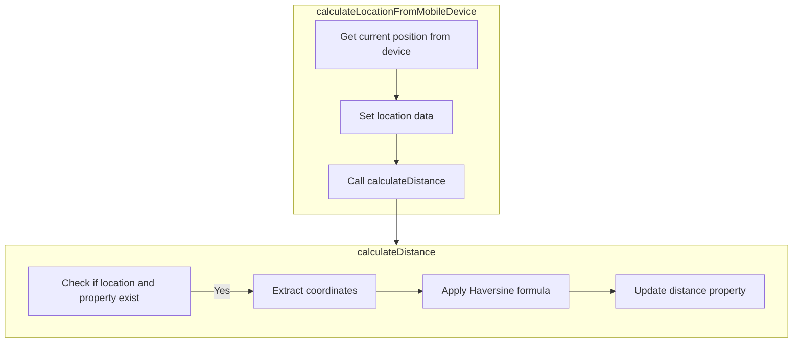

In this document, we will explore the <SwmToken path="force-app/main/default/lwc/propertyLocation/propertyLocation.js" pos="29:3:3" line-data="    async connectedCallback() {">`connectedCallback`</SwmToken> method, which is responsible for initializing the location service and determining the user's location. This method is crucial for applications that rely on accurate location data to provide relevant services to users.

The flow starts when the <SwmToken path="force-app/main/default/lwc/propertyLocation/propertyLocation.js" pos="29:3:3" line-data="    async connectedCallback() {">`connectedCallback`</SwmToken> method is invoked as the component is inserted into the DOM. It initializes the location service and checks if the service is available. If available, it calculates the location using the device's location services. If not, it checks if the browser's geolocation is available and uses it if possible. If neither is available, it sets an error message indicating that no location services are available.

Here is a high level diagram of the flow, showing only the most important functions:

```mermaid
graph TD;
      subgraph forceappmaindefaultlwcpropertyLocationpropertyLocationjs[force-app/main/default/lwc/propertyLocation/propertyLocation.js]
bff5af872549c04341fa3217cdb4fb32d69aed1accad611a16ee2729674f9542(connectedCallback) --> 086c9c680752f29117c8d93623b6f947fe07530664bcc782a57ebe1de7e80119(calculateLocationFromMobileDevice)
end

subgraph forceappmaindefaultlwcpropertyLocationpropertyLocationjs[force-app/main/default/lwc/propertyLocation/propertyLocation.js]
086c9c680752f29117c8d93623b6f947fe07530664bcc782a57ebe1de7e80119(calculateLocationFromMobileDevice) --> 697565bc0565a19bbdf86138ebc18413be17ae8fc810c0df5d4b28a77583dddc(calculateDistance)
end


      classDef mainFlowStyle color:#000000,fill:#7CB9F4
classDef rootsStyle color:#000000,fill:#00FFF4
classDef Style1 color:#000000,fill:#00FFAA
classDef Style2 color:#000000,fill:#FFFF00
classDef Style3 color:#000000,fill:#AA7CB9

%% Swimm:
%% graph TD;
%%       subgraph forceappmaindefaultlwcpropertyLocationpropertyLocationjs[<SwmPath>[force-app/main/default/lwc/propertyLocation/propertyLocation.js](force-app/main/default/lwc/propertyLocation/propertyLocation.js)</SwmPath>]
%% bff5af872549c04341fa3217cdb4fb32d69aed1accad611a16ee2729674f9542(<SwmToken path="force-app/main/default/lwc/propertyLocation/propertyLocation.js" pos="29:3:3" line-data="    async connectedCallback() {">`connectedCallback`</SwmToken>) --> 086c9c680752f29117c8d93623b6f947fe07530664bcc782a57ebe1de7e80119(<SwmToken path="force-app/main/default/lwc/propertyLocation/propertyLocation.js" pos="33:5:5" line-data="            await this.calculateLocationFromMobileDevice();">`calculateLocationFromMobileDevice`</SwmToken>)
%% end
%% 
%% subgraph forceappmaindefaultlwcpropertyLocationpropertyLocationjs[<SwmPath>[force-app/main/default/lwc/propertyLocation/propertyLocation.js](force-app/main/default/lwc/propertyLocation/propertyLocation.js)</SwmPath>]
%% 086c9c680752f29117c8d93623b6f947fe07530664bcc782a57ebe1de7e80119(<SwmToken path="force-app/main/default/lwc/propertyLocation/propertyLocation.js" pos="33:5:5" line-data="            await this.calculateLocationFromMobileDevice();">`calculateLocationFromMobileDevice`</SwmToken>) --> 697565bc0565a19bbdf86138ebc18413be17ae8fc810c0df5d4b28a77583dddc(<SwmToken path="force-app/main/default/lwc/propertyLocation/propertyLocation.js" pos="67:1:1" line-data="    calculateDistance() {">`calculateDistance`</SwmToken>)
%% end
%% 
%% 
%%       classDef mainFlowStyle color:#000000,fill:#7CB9F4
%% classDef rootsStyle color:#000000,fill:#00FFF4
%% classDef Style1 color:#000000,fill:#00FFAA
%% classDef Style2 color:#000000,fill:#FFFF00
%% classDef Style3 color:#000000,fill:#AA7CB9
```



# Flow drill down

```mermaid
graph TD
  subgraph connectedCallback
    connectedCallback:A["Get location service"] --> connectedCallback:B["Check if location service is available"]
    connectedCallback:B -->|Available| connectedCallback:C["Calculate location from mobile device"]
    connectedCallback:B -->|Not available, check geolocation support| connectedCallback:D["Check if browser supports geolocation"]
    connectedCallback:D -->|Supported| connectedCallback:E["Calculate location from browser"]
    connectedCallback:D -->|Not supported| connectedCallback:F["Set error: No location services available"]
  end

%% Swimm:
%% graph TD
%%   subgraph <SwmToken path="force-app/main/default/lwc/propertyLocation/propertyLocation.js" pos="29:3:3" line-data="    async connectedCallback() {">`connectedCallback`</SwmToken>
%%     <SwmToken path="force-app/main/default/lwc/propertyLocation/propertyLocation.js" pos="29:3:3" line-data="    async connectedCallback() {">`connectedCallback`</SwmToken>:A["Get location service"] --> <SwmToken path="force-app/main/default/lwc/propertyLocation/propertyLocation.js" pos="29:3:3" line-data="    async connectedCallback() {">`connectedCallback`</SwmToken>:B["Check if location service is available"]
%%     <SwmToken path="force-app/main/default/lwc/propertyLocation/propertyLocation.js" pos="29:3:3" line-data="    async connectedCallback() {">`connectedCallback`</SwmToken>:B -->|Available| <SwmToken path="force-app/main/default/lwc/propertyLocation/propertyLocation.js" pos="29:3:3" line-data="    async connectedCallback() {">`connectedCallback`</SwmToken>:C["Calculate location from mobile device"]
%%     <SwmToken path="force-app/main/default/lwc/propertyLocation/propertyLocation.js" pos="29:3:3" line-data="    async connectedCallback() {">`connectedCallback`</SwmToken>:B -->|Not available, check geolocation support| <SwmToken path="force-app/main/default/lwc/propertyLocation/propertyLocation.js" pos="29:3:3" line-data="    async connectedCallback() {">`connectedCallback`</SwmToken>:D["Check if browser supports geolocation"]
%%     <SwmToken path="force-app/main/default/lwc/propertyLocation/propertyLocation.js" pos="29:3:3" line-data="    async connectedCallback() {">`connectedCallback`</SwmToken>:D -->|Supported| <SwmToken path="force-app/main/default/lwc/propertyLocation/propertyLocation.js" pos="29:3:3" line-data="    async connectedCallback() {">`connectedCallback`</SwmToken>:E["Calculate location from browser"]
%%     <SwmToken path="force-app/main/default/lwc/propertyLocation/propertyLocation.js" pos="29:3:3" line-data="    async connectedCallback() {">`connectedCallback`</SwmToken>:D -->|Not supported| <SwmToken path="force-app/main/default/lwc/propertyLocation/propertyLocation.js" pos="29:3:3" line-data="    async connectedCallback() {">`connectedCallback`</SwmToken>:F["Set error: No location services available"]
%%   end
```

## Diving into <SwmToken path="force-app/main/default/lwc/propertyLocation/propertyLocation.js" pos="29:3:3" line-data="    async connectedCallback() {">`connectedCallback`</SwmToken>



## Determining the Device's Location

First, the <SwmToken path="force-app/main/default/lwc/propertyLocation/propertyLocation.js" pos="29:3:3" line-data="    async connectedCallback() {">`connectedCallback`</SwmToken> method is invoked when the component is inserted into the DOM. This method is responsible for initializing the location service and determining the user's location.

<SwmSnippet path="/force-app/main/default/lwc/propertyLocation/propertyLocation.js" line="29">

---

Next, the method assigns the location service to <SwmToken path="force-app/main/default/lwc/propertyLocation/propertyLocation.js" pos="30:1:3" line-data="        this.deviceLocationService = getLocationService();">`this.deviceLocationService`</SwmToken> by calling <SwmToken path="force-app/main/default/lwc/propertyLocation/propertyLocation.js" pos="30:7:9" line-data="        this.deviceLocationService = getLocationService();">`getLocationService()`</SwmToken>. This service is crucial for accessing the device's location capabilities.

```javascript
    async connectedCallback() {
        this.deviceLocationService = getLocationService();
```

---

</SwmSnippet>

<SwmSnippet path="/force-app/main/default/lwc/propertyLocation/propertyLocation.js" line="31">

---

Then, it checks if the location service is available using <SwmToken path="force-app/main/default/lwc/propertyLocation/propertyLocation.js" pos="31:4:10" line-data="        if (this.deviceLocationService.isAvailable()) {">`this.deviceLocationService.isAvailable()`</SwmToken>. If the service is available, it indicates that the application is running on a Salesforce mobile app on a device.

```javascript
        if (this.deviceLocationService.isAvailable()) {
            // Running on the Salesforce mobile app on a device
```

---

</SwmSnippet>

<SwmSnippet path="/force-app/main/default/lwc/propertyLocation/propertyLocation.js" line="33">

---

If the location service is available, the method calls <SwmToken path="force-app/main/default/lwc/propertyLocation/propertyLocation.js" pos="33:5:7" line-data="            await this.calculateLocationFromMobileDevice();">`calculateLocationFromMobileDevice()`</SwmToken> to calculate the current location using the device's location services. This step is essential for providing accurate location data when the application is used on a mobile device.

```javascript
            await this.calculateLocationFromMobileDevice();
```

---

</SwmSnippet>

<SwmSnippet path="/force-app/main/default/lwc/propertyLocation/propertyLocation.js" line="34">

---

If the location service is not available but the browser's geolocation is available (<SwmToken path="force-app/main/default/lwc/propertyLocation/propertyLocation.js" pos="34:8:10" line-data="        } else if (navigator.geolocation) {">`navigator.geolocation`</SwmToken>), the method calls <SwmToken path="force-app/main/default/lwc/propertyLocation/propertyLocation.js" pos="36:3:5" line-data="            this.calculateLocationFromBrowser();">`calculateLocationFromBrowser()`</SwmToken>. This ensures that the application can still determine the user's location when accessed via a web browser.

```javascript
        } else if (navigator.geolocation) {
            // Running on a browser
            this.calculateLocationFromBrowser();
```

---

</SwmSnippet>

<SwmSnippet path="/force-app/main/default/lwc/propertyLocation/propertyLocation.js" line="37">

---

Finally, if neither the device's location service nor the browser's geolocation is available, an error message is set indicating that no location services are available. This provides feedback to the user about the unavailability of location services.

```javascript
        } else {
            this.error = { message: 'No location services available' };
        }
```

---

</SwmSnippet>

## Exploring <SwmToken path="force-app/main/default/lwc/propertyLocation/propertyLocation.js" pos="33:5:5" line-data="            await this.calculateLocationFromMobileDevice();">`calculateLocationFromMobileDevice`</SwmToken> & <SwmToken path="force-app/main/default/lwc/propertyLocation/propertyLocation.js" pos="67:1:1" line-data="    calculateDistance() {">`calculateDistance`</SwmToken>



<SwmSnippet path="/force-app/main/default/lwc/propertyLocation/propertyLocation.js" line="42">

---

## Calculating the User's Current Location

First, the <SwmToken path="force-app/main/default/lwc/propertyLocation/propertyLocation.js" pos="42:3:3" line-data="    async calculateLocationFromMobileDevice() {">`calculateLocationFromMobileDevice`</SwmToken> method is responsible for obtaining the user's current geographical location using the device's location services. This is achieved by calling the <SwmToken path="force-app/main/default/lwc/propertyLocation/propertyLocation.js" pos="44:13:13" line-data="            this.location = await this.deviceLocationService.getCurrentPosition(">`getCurrentPosition`</SwmToken> method from the <SwmToken path="force-app/main/default/lwc/propertyLocation/propertyLocation.js" pos="44:11:11" line-data="            this.location = await this.deviceLocationService.getCurrentPosition(">`deviceLocationService`</SwmToken> with high accuracy enabled. This step is crucial for ensuring that the location data is precise, which is important for accurately calculating distances to properties.

```javascript
    async calculateLocationFromMobileDevice() {
        try {
            this.location = await this.deviceLocationService.getCurrentPosition(
                {
                    enableHighAccuracy: true
                }
            );
```

---

</SwmSnippet>

<SwmSnippet path="/force-app/main/default/lwc/propertyLocation/propertyLocation.js" line="50">

---

## Handling Location Retrieval Errors

Next, if there is an error while retrieving the location, it is caught and stored in the <SwmToken path="force-app/main/default/lwc/propertyLocation/propertyLocation.js" pos="50:6:6" line-data="        } catch (error) {">`error`</SwmToken> property. This ensures that any issues with obtaining the location are properly handled and can be communicated to the user or logged for further investigation.

```javascript
        } catch (error) {
            this.error = error;
        }
```

---

</SwmSnippet>

<SwmSnippet path="/force-app/main/default/lwc/propertyLocation/propertyLocation.js" line="67">

---

## Calculating the Distance to the Property

Then, the <SwmToken path="force-app/main/default/lwc/propertyLocation/propertyLocation.js" pos="67:1:1" line-data="    calculateDistance() {">`calculateDistance`</SwmToken> method is called to compute the distance between the user's current location and a specific property. This method uses the Haversine formula, which is a well-known algorithm for calculating the distance between two points on the Earth's surface based on their latitude and longitude. The calculated distance is then converted from kilometers to miles and stored in the <SwmToken path="force-app/main/default/lwc/propertyLocation/propertyLocation.js" pos="87:3:3" line-data="            this.distance = d / 1.609344;">`distance`</SwmToken> property.

```javascript
    calculateDistance() {
        if (this.location && this.property) {
            const latitude1 = this.location.coords.latitude;
            const latitude2 = getFieldValue(this.property, LATITUDE_FIELD);
            const longitude1 = this.location.coords.longitude;
            const longitude2 = getFieldValue(this.property, LONGITUDE_FIELD);

            // Haversine formula
            const deg2rad = (deg) => (deg * Math.PI) / 180.0;
            const earthRadius = 6371; // Radius of the earth in km
            const dLat = deg2rad(latitude2 - latitude1); // deg2rad below
            const dLon = deg2rad(longitude2 - longitude1);
            const a =
                Math.sin(dLat / 2) * Math.sin(dLat / 2) +
                Math.cos(deg2rad(latitude1)) *
                    Math.cos(deg2rad(latitude2)) *
                    Math.sin(dLon / 2) *
                    Math.sin(dLon / 2);
            const c = 2 * Math.atan2(Math.sqrt(a), Math.sqrt(1 - a));
            const d = earthRadius * c;
            this.distance = d / 1.609344;
```

---

</SwmSnippet>

<SwmSnippet path="/force-app/main/default/lwc/propertyLocation/propertyLocation.js" line="68">

---

### Using the Haversine Formula

Diving into the <SwmToken path="force-app/main/default/lwc/propertyLocation/propertyLocation.js" pos="67:1:1" line-data="    calculateDistance() {">`calculateDistance`</SwmToken> method, it first checks if both the user's location and the property details are available. It then extracts the latitude and longitude of both points and applies the Haversine formula to calculate the distance. This formula accounts for the spherical shape of the Earth, providing an accurate distance measurement.

```javascript
        if (this.location && this.property) {
            const latitude1 = this.location.coords.latitude;
            const latitude2 = getFieldValue(this.property, LATITUDE_FIELD);
            const longitude1 = this.location.coords.longitude;
            const longitude2 = getFieldValue(this.property, LONGITUDE_FIELD);

            // Haversine formula
            const deg2rad = (deg) => (deg * Math.PI) / 180.0;
            const earthRadius = 6371; // Radius of the earth in km
            const dLat = deg2rad(latitude2 - latitude1); // deg2rad below
            const dLon = deg2rad(longitude2 - longitude1);
            const a =
                Math.sin(dLat / 2) * Math.sin(dLat / 2) +
                Math.cos(deg2rad(latitude1)) *
                    Math.cos(deg2rad(latitude2)) *
                    Math.sin(dLon / 2) *
                    Math.sin(dLon / 2);
            const c = 2 * Math.atan2(Math.sqrt(a), Math.sqrt(1 - a));
            const d = earthRadius * c;
```

---

</SwmSnippet>

&nbsp;

*This is an auto-generated document by Swimm 🌊 and has not yet been verified by a human*

<SwmMeta version="3.0.0" repo-id="Z2l0aHViJTNBJTNBZHJlYW1ob3VzZS1sd2MlM0ElM0FTd2ltbS1EZW1v" repo-name="dreamhouse-lwc"><sup>Powered by [Swimm](/)</sup></SwmMeta>
