In this document, we will explain the process of fetching and displaying property data. The process involves checking if data is available, assigning data to properties, and displaying the properties on a map.

The flow starts by checking if the property data is available. If the data is available, it assigns the data to properties and calls a function to display the properties on a map. If the data is not available, it shows an error message. The display function checks if the map is ready, removes any existing property layers, prepares property icons, sets up click handlers, generates markers, and adds the markers to the map.

# Flow drill down

```mermaid
graph TD
  subgraph wiredProperties
    wiredProperties:A["Check if data is available"] -->|Yes| wiredProperties:B["Assign data to properties"]
    wiredProperties:B --> wiredProperties:C["Call displayProperties"]
    wiredProperties:A -->|No| wiredProperties:D["Show error toast message"]
  end
  subgraph displayProperties
    displayProperties:A["Check if Leaflet is ready"] -->|Yes| displayProperties:B["Remove existing property layer"]
    displayProperties:B --> displayProperties:C["Prepare property icon"]
    displayProperties:C --> displayProperties:D["Setup click handler"]
    displayProperties:D --> displayProperties:E["Generate markers"]
    displayProperties:E --> displayProperties:F["Add markers to map"]
    displayProperties:A -->|No| displayProperties:G["Exit function"]
  end
  wiredProperties:C --> displayProperties

%% Swimm:
%% graph TD
%%   subgraph <SwmToken path="force-app/main/default/lwc/propertyListMap/propertyListMap.js" pos="47:1:1" line-data="    wiredProperties({ error, data }) {">`wiredProperties`</SwmToken>
%%     <SwmToken path="force-app/main/default/lwc/propertyListMap/propertyListMap.js" pos="47:1:1" line-data="    wiredProperties({ error, data }) {">`wiredProperties`</SwmToken>:A["Check if data is available"] -->|Yes| <SwmToken path="force-app/main/default/lwc/propertyListMap/propertyListMap.js" pos="47:1:1" line-data="    wiredProperties({ error, data }) {">`wiredProperties`</SwmToken>:B["Assign data to properties"]
%%     <SwmToken path="force-app/main/default/lwc/propertyListMap/propertyListMap.js" pos="47:1:1" line-data="    wiredProperties({ error, data }) {">`wiredProperties`</SwmToken>:B --> <SwmToken path="force-app/main/default/lwc/propertyListMap/propertyListMap.js" pos="47:1:1" line-data="    wiredProperties({ error, data }) {">`wiredProperties`</SwmToken>:C["Call <SwmToken path="force-app/main/default/lwc/propertyListMap/propertyListMap.js" pos="51:3:3" line-data="            this.displayProperties();">`displayProperties`</SwmToken>"]
%%     <SwmToken path="force-app/main/default/lwc/propertyListMap/propertyListMap.js" pos="47:1:1" line-data="    wiredProperties({ error, data }) {">`wiredProperties`</SwmToken>:A -->|No| <SwmToken path="force-app/main/default/lwc/propertyListMap/propertyListMap.js" pos="47:1:1" line-data="    wiredProperties({ error, data }) {">`wiredProperties`</SwmToken>:D["Show error toast message"]
%%   end
%%   subgraph <SwmToken path="force-app/main/default/lwc/propertyListMap/propertyListMap.js" pos="51:3:3" line-data="            this.displayProperties();">`displayProperties`</SwmToken>
%%     <SwmToken path="force-app/main/default/lwc/propertyListMap/propertyListMap.js" pos="51:3:3" line-data="            this.displayProperties();">`displayProperties`</SwmToken>:A["Check if Leaflet is ready"] -->|Yes| <SwmToken path="force-app/main/default/lwc/propertyListMap/propertyListMap.js" pos="51:3:3" line-data="            this.displayProperties();">`displayProperties`</SwmToken>:B["Remove existing property layer"]
%%     <SwmToken path="force-app/main/default/lwc/propertyListMap/propertyListMap.js" pos="51:3:3" line-data="            this.displayProperties();">`displayProperties`</SwmToken>:B --> <SwmToken path="force-app/main/default/lwc/propertyListMap/propertyListMap.js" pos="51:3:3" line-data="            this.displayProperties();">`displayProperties`</SwmToken>:C["Prepare property icon"]
%%     <SwmToken path="force-app/main/default/lwc/propertyListMap/propertyListMap.js" pos="51:3:3" line-data="            this.displayProperties();">`displayProperties`</SwmToken>:C --> <SwmToken path="force-app/main/default/lwc/propertyListMap/propertyListMap.js" pos="51:3:3" line-data="            this.displayProperties();">`displayProperties`</SwmToken>:D["Setup click handler"]
%%     <SwmToken path="force-app/main/default/lwc/propertyListMap/propertyListMap.js" pos="51:3:3" line-data="            this.displayProperties();">`displayProperties`</SwmToken>:D --> <SwmToken path="force-app/main/default/lwc/propertyListMap/propertyListMap.js" pos="51:3:3" line-data="            this.displayProperties();">`displayProperties`</SwmToken>:E["Generate markers"]
%%     <SwmToken path="force-app/main/default/lwc/propertyListMap/propertyListMap.js" pos="51:3:3" line-data="            this.displayProperties();">`displayProperties`</SwmToken>:E --> <SwmToken path="force-app/main/default/lwc/propertyListMap/propertyListMap.js" pos="51:3:3" line-data="            this.displayProperties();">`displayProperties`</SwmToken>:F["Add markers to map"]
%%     <SwmToken path="force-app/main/default/lwc/propertyListMap/propertyListMap.js" pos="51:3:3" line-data="            this.displayProperties();">`displayProperties`</SwmToken>:A -->|No| <SwmToken path="force-app/main/default/lwc/propertyListMap/propertyListMap.js" pos="51:3:3" line-data="            this.displayProperties();">`displayProperties`</SwmToken>:G["Exit function"]
%%   end
%%   <SwmToken path="force-app/main/default/lwc/propertyListMap/propertyListMap.js" pos="47:1:1" line-data="    wiredProperties({ error, data }) {">`wiredProperties`</SwmToken>:C --> <SwmToken path="force-app/main/default/lwc/propertyListMap/propertyListMap.js" pos="51:3:3" line-data="            this.displayProperties();">`displayProperties`</SwmToken>
```



<SwmSnippet path="/force-app/main/default/lwc/propertyListMap/propertyListMap.js" line="39">

---

## Fetching Property Data

First, the <SwmToken path="force-app/main/default/lwc/propertyListMap/propertyListMap.js" pos="47:1:1" line-data="    wiredProperties({ error, data }) {">`wiredProperties`</SwmToken> function is responsible for fetching property data based on various search criteria such as search key, price range, and number of bedrooms and bathrooms. This function uses the <SwmToken path="force-app/main/default/lwc/propertyListMap/propertyListMap.js" pos="39:1:2" line-data="    @wire(getPagedPropertyList, {">`@wire`</SwmToken> decorator to call the <SwmToken path="force-app/main/default/lwc/propertyListMap/propertyListMap.js" pos="39:4:4" line-data="    @wire(getPagedPropertyList, {">`getPagedPropertyList`</SwmToken> method, which retrieves the data from the server.

```javascript
    @wire(getPagedPropertyList, {
        searchKey: '$searchKey',
        maxPrice: '$maxPrice',
        minBedrooms: '$minBedrooms',
        minBathrooms: '$minBathrooms',
        pageSize: '$pageSize',
        pageNumber: '$pageNumber'
    })
```

---

</SwmSnippet>

<SwmSnippet path="/force-app/main/default/lwc/propertyListMap/propertyListMap.js" line="47">

---

## Handling Data Response

Next, the <SwmToken path="force-app/main/default/lwc/propertyListMap/propertyListMap.js" pos="47:1:1" line-data="    wiredProperties({ error, data }) {">`wiredProperties`</SwmToken> function processes the response from the server. If the data is successfully retrieved, it assigns the property records to the <SwmToken path="force-app/main/default/lwc/propertyListMap/propertyListMap.js" pos="49:3:3" line-data="            this.properties = data.records;">`properties`</SwmToken> attribute and calls the <SwmToken path="force-app/main/default/lwc/propertyListMap/propertyListMap.js" pos="51:3:3" line-data="            this.displayProperties();">`displayProperties`</SwmToken> function to display them on the map. If there is an error, it clears the <SwmToken path="force-app/main/default/lwc/propertyListMap/propertyListMap.js" pos="49:3:3" line-data="            this.properties = data.records;">`properties`</SwmToken> attribute and shows an error message to the user.

```javascript
    wiredProperties({ error, data }) {
        if (data) {
            this.properties = data.records;
            // Display properties on map
            this.displayProperties();
        } else if (error) {
            this.properties = [];
            this.dispatchEvent(
                new ShowToastEvent({
                    title: 'Error loading properties',
                    message: error.message,
                    variant: 'error'
                })
            );
        }
```

---

</SwmSnippet>

<SwmSnippet path="/force-app/main/default/lwc/propertyListMap/propertyListMap.js" line="127">

---

## Displaying Properties on Map

Moving to the <SwmToken path="force-app/main/default/lwc/propertyListMap/propertyListMap.js" pos="127:1:1" line-data="    displayProperties() {">`displayProperties`</SwmToken> function, it is responsible for displaying the fetched properties on a map using Leaflet.js. The function first checks if Leaflet is ready and removes any existing property layer from the map. It then creates a property icon and a click handler for the property markers.

```javascript
    displayProperties() {
        // Stop if leaflet isn't ready yet
        if (this.leafletState !== LEAFLET_READY) {
            return;
        }

        // Remove previous property layer form map if it exits
        if (this.propertyLayer) {
            this.map.removeLayer(this.propertyLayer);
        }

        // Prepare property icon
        const icon = L.divIcon({
            className: 'my-div-icon',
            html: '<svg xmlns="http://www.w3.org/2000/svg" width="24" height="24" viewBox="0 0 52 52"><path fill="#DB4437" d="m26 2c-10.5 0-19 8.5-19 19.1 0 13.2 13.6 25.3 17.8 28.5 0.7 0.6 1.7 0.6 2.5 0 4.2-3.3 17.7-15.3 17.7-28.5 0-10.6-8.5-19.1-19-19.1z m0 27c-4.4 0-8-3.6-8-8s3.6-8 8-8 8 3.6 8 8-3.6 8-8 8z"></path></svg>'
        });

        // Prepare click handler for property marker
        const markerClickHandler = (event) => {
            // Send message using the Lightning Message Service
            const message = { propertyId: event.target.propertyId };
```

---

</SwmSnippet>

<SwmSnippet path="/force-app/main/default/lwc/propertyListMap/propertyListMap.js" line="150">

---

## Creating Property Markers

Then, the <SwmToken path="force-app/main/default/lwc/propertyListMap/propertyListMap.js" pos="51:3:3" line-data="            this.displayProperties();">`displayProperties`</SwmToken> function generates markers for each property using their latitude and longitude. It binds a tooltip to each marker and adds a click event handler that publishes a message with the property ID when the marker is clicked.

```javascript

        // Prepare property markers
        const markers = this.properties.map((property) => {
            const latLng = [
                property.Location__Latitude__s,
                property.Location__Longitude__s
            ];
            const tooltipMarkup = this.getTooltipMarkup(property);
            const marker = L.marker(latLng, { icon });
            marker.propertyId = property.Id;
            marker.on('click', markerClickHandler);
            marker.bindTooltip(tooltipMarkup, { offset: [45, -40] });
            return marker;
        });
```

---

</SwmSnippet>

<SwmSnippet path="/force-app/main/default/lwc/propertyListMap/propertyListMap.js" line="164">

---

## Adding Markers to Map

Finally, the <SwmToken path="force-app/main/default/lwc/propertyListMap/propertyListMap.js" pos="51:3:3" line-data="            this.displayProperties();">`displayProperties`</SwmToken> function creates a layer with the property markers and adds it to the map, making the properties visible to the user.

```javascript

        // Create a layer with property markers and add it to map
        this.propertyLayer = L.layerGroup(markers);
        this.propertyLayer.addTo(this.map);
    }
```

---

</SwmSnippet>

&nbsp;

*This is an auto-generated document by Swimm 🌊 and has not yet been verified by a human*

<SwmMeta version="3.0.0" repo-id="Z2l0aHViJTNBJTNBZHJlYW1ob3VzZS1sd2MlM0ElM0FTd2ltbS1EZW1v" repo-name="dreamhouse-lwc"><sup>Powered by [Swimm](/)</sup></SwmMeta>
