In this document, we will explain the process of handling and displaying property data on a map. The process involves fetching property data, handling errors, and displaying the properties on a map using the Leaflet library.

The flow starts by checking if the data exists. If the data is available, it sets the properties data and displays them on the map. If the data is not available, it sets the properties to empty and shows an error message. Next, it checks if the Leaflet library is ready. If it is not ready, it returns early. If it is ready, it removes any previous property layers from the map, prepares a custom icon for the property markers, sets up a click handler for these markers, creates markers for each property, and adds them to a layer group, making the properties visible on the map.

# Flow drill down

```mermaid
graph TD
subgraph wiredProperties
wiredProperties:A["Check if data exists"] --> |Yes| wiredProperties:B["Set properties data"]
wiredProperties:B --> wiredProperties:C["Display properties on map"]
wiredProperties:A --> |No| wiredProperties:D["Set properties to empty"]
wiredProperties:D --> wiredProperties:E["Show error message"]
end
subgraph displayProperties
displayProperties:A["Check if leaflet is ready"] --> |Not Ready| displayProperties:B["Return"]
displayProperties:A --> |Ready| displayProperties:C["Remove previous property layers"]
displayProperties:C --> displayProperties:D["Prepare property icon"]
displayProperties:D --> displayProperties:E["Prepare click handler"]
displayProperties:E --> displayProperties:F["Create property markers"]
displayProperties:F --> displayProperties:G["Create a layer and add to map"]
end
wiredProperties:C --> displayProperties

%% Swimm:
%% graph TD
%% subgraph <SwmToken path="force-app/main/default/lwc/propertyListMap/propertyListMap.js" pos="47:1:1" line-data="    wiredProperties({ error, data }) {">`wiredProperties`</SwmToken>
%% <SwmToken path="force-app/main/default/lwc/propertyListMap/propertyListMap.js" pos="47:1:1" line-data="    wiredProperties({ error, data }) {">`wiredProperties`</SwmToken>:A["Check if data exists"] --> |Yes| <SwmToken path="force-app/main/default/lwc/propertyListMap/propertyListMap.js" pos="47:1:1" line-data="    wiredProperties({ error, data }) {">`wiredProperties`</SwmToken>:B["Set properties data"]
%% <SwmToken path="force-app/main/default/lwc/propertyListMap/propertyListMap.js" pos="47:1:1" line-data="    wiredProperties({ error, data }) {">`wiredProperties`</SwmToken>:B --> <SwmToken path="force-app/main/default/lwc/propertyListMap/propertyListMap.js" pos="47:1:1" line-data="    wiredProperties({ error, data }) {">`wiredProperties`</SwmToken>:C["Display properties on map"]
%% <SwmToken path="force-app/main/default/lwc/propertyListMap/propertyListMap.js" pos="47:1:1" line-data="    wiredProperties({ error, data }) {">`wiredProperties`</SwmToken>:A --> |No| <SwmToken path="force-app/main/default/lwc/propertyListMap/propertyListMap.js" pos="47:1:1" line-data="    wiredProperties({ error, data }) {">`wiredProperties`</SwmToken>:D["Set properties to empty"]
%% <SwmToken path="force-app/main/default/lwc/propertyListMap/propertyListMap.js" pos="47:1:1" line-data="    wiredProperties({ error, data }) {">`wiredProperties`</SwmToken>:D --> <SwmToken path="force-app/main/default/lwc/propertyListMap/propertyListMap.js" pos="47:1:1" line-data="    wiredProperties({ error, data }) {">`wiredProperties`</SwmToken>:E["Show error message"]
%% end
%% subgraph <SwmToken path="force-app/main/default/lwc/propertyListMap/propertyListMap.js" pos="51:3:3" line-data="            this.displayProperties();">`displayProperties`</SwmToken>
%% <SwmToken path="force-app/main/default/lwc/propertyListMap/propertyListMap.js" pos="51:3:3" line-data="            this.displayProperties();">`displayProperties`</SwmToken>:A["Check if leaflet is ready"] --> |Not Ready| <SwmToken path="force-app/main/default/lwc/propertyListMap/propertyListMap.js" pos="51:3:3" line-data="            this.displayProperties();">`displayProperties`</SwmToken>:B["Return"]
%% <SwmToken path="force-app/main/default/lwc/propertyListMap/propertyListMap.js" pos="51:3:3" line-data="            this.displayProperties();">`displayProperties`</SwmToken>:A --> |Ready| <SwmToken path="force-app/main/default/lwc/propertyListMap/propertyListMap.js" pos="51:3:3" line-data="            this.displayProperties();">`displayProperties`</SwmToken>:C["Remove previous property layers"]
%% <SwmToken path="force-app/main/default/lwc/propertyListMap/propertyListMap.js" pos="51:3:3" line-data="            this.displayProperties();">`displayProperties`</SwmToken>:C --> <SwmToken path="force-app/main/default/lwc/propertyListMap/propertyListMap.js" pos="51:3:3" line-data="            this.displayProperties();">`displayProperties`</SwmToken>:D["Prepare property icon"]
%% <SwmToken path="force-app/main/default/lwc/propertyListMap/propertyListMap.js" pos="51:3:3" line-data="            this.displayProperties();">`displayProperties`</SwmToken>:D --> <SwmToken path="force-app/main/default/lwc/propertyListMap/propertyListMap.js" pos="51:3:3" line-data="            this.displayProperties();">`displayProperties`</SwmToken>:E["Prepare click handler"]
%% <SwmToken path="force-app/main/default/lwc/propertyListMap/propertyListMap.js" pos="51:3:3" line-data="            this.displayProperties();">`displayProperties`</SwmToken>:E --> <SwmToken path="force-app/main/default/lwc/propertyListMap/propertyListMap.js" pos="51:3:3" line-data="            this.displayProperties();">`displayProperties`</SwmToken>:F["Create property markers"]
%% <SwmToken path="force-app/main/default/lwc/propertyListMap/propertyListMap.js" pos="51:3:3" line-data="            this.displayProperties();">`displayProperties`</SwmToken>:F --> <SwmToken path="force-app/main/default/lwc/propertyListMap/propertyListMap.js" pos="51:3:3" line-data="            this.displayProperties();">`displayProperties`</SwmToken>:G["Create a layer and add to map"]
%% end
%% <SwmToken path="force-app/main/default/lwc/propertyListMap/propertyListMap.js" pos="47:1:1" line-data="    wiredProperties({ error, data }) {">`wiredProperties`</SwmToken>:C --> <SwmToken path="force-app/main/default/lwc/propertyListMap/propertyListMap.js" pos="51:3:3" line-data="            this.displayProperties();">`displayProperties`</SwmToken>
```



<SwmSnippet path="/force-app/main/default/lwc/propertyListMap/propertyListMap.js" line="39">

---

## Handling Property Data

First, the <SwmToken path="force-app/main/default/lwc/propertyListMap/propertyListMap.js" pos="47:1:1" line-data="    wiredProperties({ error, data }) {">`wiredProperties`</SwmToken> method is responsible for fetching property data based on various search criteria such as search key, price range, and number of bedrooms and bathrooms. This data is then stored in the <SwmToken path="force-app/main/default/lwc/propertyListMap/propertyListMap.js" pos="49:3:3" line-data="            this.properties = data.records;">`properties`</SwmToken> attribute if the fetch is successful.

```javascript
    @wire(getPagedPropertyList, {
        searchKey: '$searchKey',
        maxPrice: '$maxPrice',
        minBedrooms: '$minBedrooms',
        minBathrooms: '$minBathrooms',
        pageSize: '$pageSize',
        pageNumber: '$pageNumber'
    })
    wiredProperties({ error, data }) {
        if (data) {
            this.properties = data.records;
```

---

</SwmSnippet>

<SwmSnippet path="/force-app/main/default/lwc/propertyListMap/propertyListMap.js" line="50">

---

If there is an error while fetching the data, the <SwmToken path="force-app/main/default/lwc/propertyListMap/propertyListMap.js" pos="50:5:5" line-data="            // Display properties on map">`properties`</SwmToken> attribute is set to an empty array, and an error message is displayed to the user using a toast notification.

```javascript
            // Display properties on map
            this.displayProperties();
        } else if (error) {
            this.properties = [];
            this.dispatchEvent(
                new ShowToastEvent({
                    title: 'Error loading properties',
                    message: error.message,
                    variant: 'error'
                })
            );
        }
```

---

</SwmSnippet>

<SwmSnippet path="/force-app/main/default/lwc/propertyListMap/propertyListMap.js" line="127">

---

## Displaying Properties on the Map

Next, the <SwmToken path="force-app/main/default/lwc/propertyListMap/propertyListMap.js" pos="127:1:1" line-data="    displayProperties() {">`displayProperties`</SwmToken> method is called to display the fetched properties on a map. This method first checks if the Leaflet library is ready. If not, it exits early.

```javascript
    displayProperties() {
        // Stop if leaflet isn't ready yet
        if (this.leafletState !== LEAFLET_READY) {
            return;
```

---

</SwmSnippet>

<SwmSnippet path="/force-app/main/default/lwc/propertyListMap/propertyListMap.js" line="131">

---

If the Leaflet library is ready, it removes any existing property layers from the map to avoid duplication.

```javascript
        }

        // Remove previous property layer form map if it exits
        if (this.propertyLayer) {
            this.map.removeLayer(this.propertyLayer);
        }
```

---

</SwmSnippet>

<SwmSnippet path="/force-app/main/default/lwc/propertyListMap/propertyListMap.js" line="137">

---

Then, it prepares a custom icon for the property markers and sets up a click handler for these markers. The click handler sends a message using the Lightning Message Service when a marker is clicked.

```javascript

        // Prepare property icon
        const icon = L.divIcon({
            className: 'my-div-icon',
            html: '<svg xmlns="http://www.w3.org/2000/svg" width="24" height="24" viewBox="0 0 52 52"><path fill="#DB4437" d="m26 2c-10.5 0-19 8.5-19 19.1 0 13.2 13.6 25.3 17.8 28.5 0.7 0.6 1.7 0.6 2.5 0 4.2-3.3 17.7-15.3 17.7-28.5 0-10.6-8.5-19.1-19-19.1z m0 27c-4.4 0-8-3.6-8-8s3.6-8 8-8 8 3.6 8 8-3.6 8-8 8z"></path></svg>'
        });

        // Prepare click handler for property marker
        const markerClickHandler = (event) => {
            // Send message using the Lightning Message Service
            const message = { propertyId: event.target.propertyId };
            publish(this.messageContext, PROPERTY_SELECTED, message);
        };
```

---

</SwmSnippet>

<SwmSnippet path="/force-app/main/default/lwc/propertyListMap/propertyListMap.js" line="150">

---

The method then creates markers for each property using their latitude and longitude, binds tooltips to these markers, and adds them to a layer group.

```javascript

        // Prepare property markers
        const markers = this.properties.map((property) => {
            const latLng = [
                property.Location__Latitude__s,
                property.Location__Longitude__s
            ];
            const tooltipMarkup = this.getTooltipMarkup(property);
            const marker = L.marker(latLng, { icon });
            marker.propertyId = property.Id;
            marker.on('click', markerClickHandler);
            marker.bindTooltip(tooltipMarkup, { offset: [45, -40] });
            return marker;
        });
```

---

</SwmSnippet>

<SwmSnippet path="/force-app/main/default/lwc/propertyListMap/propertyListMap.js" line="164">

---

Finally, this layer group containing all the property markers is added to the map, making the properties visible to the user.

```javascript

        // Create a layer with property markers and add it to map
        this.propertyLayer = L.layerGroup(markers);
        this.propertyLayer.addTo(this.map);
    }
```

---

</SwmSnippet>

&nbsp;

*This is an auto-generated document by Swimm 🌊 and has not yet been verified by a human*

<SwmMeta version="3.0.0" repo-id="Z2l0aHViJTNBJTNBZHJlYW1ob3VzZS1sd2MlM0ElM0FTd2ltbS1EZW1v" repo-name="dreamhouse-lwc"><sup>Powered by [Swimm](/)</sup></SwmMeta>
