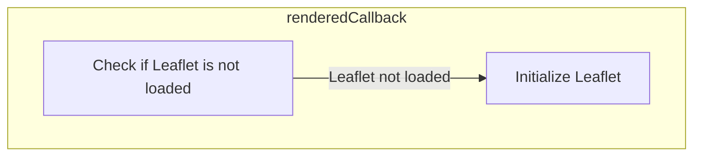

```mermaid
graph TD
  subgraph initializeLeaflet
    initializeLeaflet:A["Set leaflet state to loading"] --> initializeLeaflet:B["Load script and style"]
    initializeLeaflet:B --> initializeLeaflet:C["Configure map"]
    initializeLeaflet:C --> initializeLeaflet:D["Set leaflet state to ready"]
    initializeLeaflet:D --> initializeLeaflet:E["Display properties"]
  end
  subgraph displayProperties
    displayProperties:A["Check if leaflet is ready"] --|Not ready|--> displayProperties:B["Return"]
    displayProperties:A -->|Ready| displayProperties:C["Remove previous property layer"]
    displayProperties:C --> displayProperties:D["Prepare property icon"]
    displayProperties:D --> displayProperties:E["Prepare click handler"]
    displayProperties:E --> displayProperties:F["Prepare property markers"]
    displayProperties:F --> displayProperties:G["Create layer with markers"]
    displayProperties:G --> displayProperties:H["Add layer to map"]
  end
  initializeLeaflet:E --> displayProperties

%% Swimm:
%% graph TD
%%   subgraph <SwmToken path="force-app/main/default/lwc/propertyListMap/propertyListMap.js" pos="81:5:5" line-data="            await this.initializeLeaflet();">`initializeLeaflet`</SwmToken>
%%     <SwmToken path="force-app/main/default/lwc/propertyListMap/propertyListMap.js" pos="81:5:5" line-data="            await this.initializeLeaflet();">`initializeLeaflet`</SwmToken>:A["Set leaflet state to loading"] --> <SwmToken path="force-app/main/default/lwc/propertyListMap/propertyListMap.js" pos="81:5:5" line-data="            await this.initializeLeaflet();">`initializeLeaflet`</SwmToken>:B["Load script and style"]
%%     <SwmToken path="force-app/main/default/lwc/propertyListMap/propertyListMap.js" pos="81:5:5" line-data="            await this.initializeLeaflet();">`initializeLeaflet`</SwmToken>:B --> <SwmToken path="force-app/main/default/lwc/propertyListMap/propertyListMap.js" pos="81:5:5" line-data="            await this.initializeLeaflet();">`initializeLeaflet`</SwmToken>:C["Configure map"]
%%     <SwmToken path="force-app/main/default/lwc/propertyListMap/propertyListMap.js" pos="81:5:5" line-data="            await this.initializeLeaflet();">`initializeLeaflet`</SwmToken>:C --> <SwmToken path="force-app/main/default/lwc/propertyListMap/propertyListMap.js" pos="81:5:5" line-data="            await this.initializeLeaflet();">`initializeLeaflet`</SwmToken>:D["Set leaflet state to ready"]
%%     <SwmToken path="force-app/main/default/lwc/propertyListMap/propertyListMap.js" pos="81:5:5" line-data="            await this.initializeLeaflet();">`initializeLeaflet`</SwmToken>:D --> <SwmToken path="force-app/main/default/lwc/propertyListMap/propertyListMap.js" pos="81:5:5" line-data="            await this.initializeLeaflet();">`initializeLeaflet`</SwmToken>:E["Display properties"]
%%   end
%%   subgraph <SwmToken path="force-app/main/default/lwc/propertyListMap/propertyListMap.js" pos="114:3:3" line-data="            this.displayProperties();">`displayProperties`</SwmToken>
%%     <SwmToken path="force-app/main/default/lwc/propertyListMap/propertyListMap.js" pos="114:3:3" line-data="            this.displayProperties();">`displayProperties`</SwmToken>:A["Check if leaflet is ready"] --|Not ready|--> <SwmToken path="force-app/main/default/lwc/propertyListMap/propertyListMap.js" pos="114:3:3" line-data="            this.displayProperties();">`displayProperties`</SwmToken>:B["Return"]
%%     <SwmToken path="force-app/main/default/lwc/propertyListMap/propertyListMap.js" pos="114:3:3" line-data="            this.displayProperties();">`displayProperties`</SwmToken>:A -->|Ready| <SwmToken path="force-app/main/default/lwc/propertyListMap/propertyListMap.js" pos="114:3:3" line-data="            this.displayProperties();">`displayProperties`</SwmToken>:C["Remove previous property layer"]
%%     <SwmToken path="force-app/main/default/lwc/propertyListMap/propertyListMap.js" pos="114:3:3" line-data="            this.displayProperties();">`displayProperties`</SwmToken>:C --> <SwmToken path="force-app/main/default/lwc/propertyListMap/propertyListMap.js" pos="114:3:3" line-data="            this.displayProperties();">`displayProperties`</SwmToken>:D["Prepare property icon"]
%%     <SwmToken path="force-app/main/default/lwc/propertyListMap/propertyListMap.js" pos="114:3:3" line-data="            this.displayProperties();">`displayProperties`</SwmToken>:D --> <SwmToken path="force-app/main/default/lwc/propertyListMap/propertyListMap.js" pos="114:3:3" line-data="            this.displayProperties();">`displayProperties`</SwmToken>:E["Prepare click handler"]
%%     <SwmToken path="force-app/main/default/lwc/propertyListMap/propertyListMap.js" pos="114:3:3" line-data="            this.displayProperties();">`displayProperties`</SwmToken>:E --> <SwmToken path="force-app/main/default/lwc/propertyListMap/propertyListMap.js" pos="114:3:3" line-data="            this.displayProperties();">`displayProperties`</SwmToken>:F["Prepare property markers"]
%%     <SwmToken path="force-app/main/default/lwc/propertyListMap/propertyListMap.js" pos="114:3:3" line-data="            this.displayProperties();">`displayProperties`</SwmToken>:F --> <SwmToken path="force-app/main/default/lwc/propertyListMap/propertyListMap.js" pos="114:3:3" line-data="            this.displayProperties();">`displayProperties`</SwmToken>:G["Create layer with markers"]
%%     <SwmToken path="force-app/main/default/lwc/propertyListMap/propertyListMap.js" pos="114:3:3" line-data="            this.displayProperties();">`displayProperties`</SwmToken>:G --> <SwmToken path="force-app/main/default/lwc/propertyListMap/propertyListMap.js" pos="114:3:3" line-data="            this.displayProperties();">`displayProperties`</SwmToken>:H["Add layer to map"]
%%   end
%%   <SwmToken path="force-app/main/default/lwc/propertyListMap/propertyListMap.js" pos="81:5:5" line-data="            await this.initializeLeaflet();">`initializeLeaflet`</SwmToken>:E --> <SwmToken path="force-app/main/default/lwc/propertyListMap/propertyListMap.js" pos="114:3:3" line-data="            this.displayProperties();">`displayProperties`</SwmToken>
```

In this document, we will explain the flow of the <SwmToken path="force-app/main/default/lwc/propertyListMap/propertyListMap.js" pos="79:3:3" line-data="    async renderedCallback() {">`renderedCallback`</SwmToken> method. This method is a lifecycle hook in Lightning Web Components that is called after every render of the component. It ensures that the component's DOM is updated and ready for interaction.

The flow starts with the <SwmToken path="force-app/main/default/lwc/propertyListMap/propertyListMap.js" pos="79:3:3" line-data="    async renderedCallback() {">`renderedCallback`</SwmToken> method checking if the Leaflet library is loaded. If not, it initializes the Leaflet library. Once Leaflet is ready, it proceeds to display property markers on the map. This involves configuring the map, adding tile layers, and creating markers for each property.

Here is a high level diagram of the flow, showing only the most important functions:

```mermaid
graph TD;
      subgraph forceappmaindefaultlwcpropertyListMappropertyListMapjs[force-app/main/default/lwc/propertyListMap/propertyListMap.js]
db1ae4224e582b336956fb2640b2aaa3b0200361bd92eba62da901a333e1f10c(renderedCallback) --> 1b59865e4dbea9464e7624e75e1f05e5fe91c7276ae9a955f0e1f98f5cd9055c(initializeLeaflet)
end

subgraph forceappmaindefaultlwcpropertyListMappropertyListMapjs[force-app/main/default/lwc/propertyListMap/propertyListMap.js]
1b59865e4dbea9464e7624e75e1f05e5fe91c7276ae9a955f0e1f98f5cd9055c(initializeLeaflet) --> 53c314e3b8654abf7920bbb13d9c4271b24805f395ca18e920295e5162fe9ed1(displayProperties)
end


      classDef mainFlowStyle color:#000000,fill:#7CB9F4
classDef rootsStyle color:#000000,fill:#00FFF4
classDef Style1 color:#000000,fill:#00FFAA
classDef Style2 color:#000000,fill:#FFFF00
classDef Style3 color:#000000,fill:#AA7CB9

%% Swimm:
%% graph TD;
%%       subgraph forceappmaindefaultlwcpropertyListMappropertyListMapjs[<SwmPath>[force-app/main/default/lwc/propertyListMap/propertyListMap.js](force-app/main/default/lwc/propertyListMap/propertyListMap.js)</SwmPath>]
%% db1ae4224e582b336956fb2640b2aaa3b0200361bd92eba62da901a333e1f10c(<SwmToken path="force-app/main/default/lwc/propertyListMap/propertyListMap.js" pos="79:3:3" line-data="    async renderedCallback() {">`renderedCallback`</SwmToken>) --> 1b59865e4dbea9464e7624e75e1f05e5fe91c7276ae9a955f0e1f98f5cd9055c(<SwmToken path="force-app/main/default/lwc/propertyListMap/propertyListMap.js" pos="81:5:5" line-data="            await this.initializeLeaflet();">`initializeLeaflet`</SwmToken>)
%% end
%% 
%% subgraph forceappmaindefaultlwcpropertyListMappropertyListMapjs[<SwmPath>[force-app/main/default/lwc/propertyListMap/propertyListMap.js](force-app/main/default/lwc/propertyListMap/propertyListMap.js)</SwmPath>]
%% 1b59865e4dbea9464e7624e75e1f05e5fe91c7276ae9a955f0e1f98f5cd9055c(<SwmToken path="force-app/main/default/lwc/propertyListMap/propertyListMap.js" pos="81:5:5" line-data="            await this.initializeLeaflet();">`initializeLeaflet`</SwmToken>) --> 53c314e3b8654abf7920bbb13d9c4271b24805f395ca18e920295e5162fe9ed1(<SwmToken path="force-app/main/default/lwc/propertyListMap/propertyListMap.js" pos="114:3:3" line-data="            this.displayProperties();">`displayProperties`</SwmToken>)
%% end
%% 
%% 
%%       classDef mainFlowStyle color:#000000,fill:#7CB9F4
%% classDef rootsStyle color:#000000,fill:#00FFF4
%% classDef Style1 color:#000000,fill:#00FFAA
%% classDef Style2 color:#000000,fill:#FFFF00
%% classDef Style3 color:#000000,fill:#AA7CB9
```



# Flow drill down

## Inside <SwmToken path="force-app/main/default/lwc/propertyListMap/propertyListMap.js" pos="79:3:3" line-data="    async renderedCallback() {">`renderedCallback`</SwmToken>



## <SwmToken path="force-app/main/default/lwc/propertyListMap/propertyListMap.js" pos="79:3:3" line-data="    async renderedCallback() {">`renderedCallback`</SwmToken>

The <SwmToken path="force-app/main/default/lwc/propertyListMap/propertyListMap.js" pos="79:3:3" line-data="    async renderedCallback() {">`renderedCallback`</SwmToken> method is a lifecycle hook in Lightning Web Components that is called after every render of the component. It ensures that the component's DOM is updated and ready for interaction.

<SwmSnippet path="/force-app/main/default/lwc/propertyListMap/propertyListMap.js" line="79">

---

First, the <SwmToken path="force-app/main/default/lwc/propertyListMap/propertyListMap.js" pos="79:3:3" line-data="    async renderedCallback() {">`renderedCallback`</SwmToken> method checks if the Leaflet library has been loaded by evaluating the <SwmToken path="force-app/main/default/lwc/propertyListMap/propertyListMap.js" pos="80:6:6" line-data="        if (this.leafletState === LEAFLET_NOT_LOADED) {">`leafletState`</SwmToken> property. If the library is not loaded (<SwmToken path="force-app/main/default/lwc/propertyListMap/propertyListMap.js" pos="80:10:10" line-data="        if (this.leafletState === LEAFLET_NOT_LOADED) {">`LEAFLET_NOT_LOADED`</SwmToken>), it proceeds to initialize the Leaflet library by calling the <SwmToken path="force-app/main/default/lwc/propertyListMap/propertyListMap.js" pos="81:5:5" line-data="            await this.initializeLeaflet();">`initializeLeaflet`</SwmToken> method.

```javascript
    async renderedCallback() {
        if (this.leafletState === LEAFLET_NOT_LOADED) {
            await this.initializeLeaflet();
        }
    }
```

---

</SwmSnippet>

## Initializing the Leaflet library

The <SwmToken path="force-app/main/default/lwc/propertyListMap/propertyListMap.js" pos="81:5:5" line-data="            await this.initializeLeaflet();">`initializeLeaflet`</SwmToken> method is responsible for loading and configuring the Leaflet map library. This includes setting up the map's initial state, adding necessary layers, and handling any potential errors that may occur during the initialization process.

<SwmSnippet path="/force-app/main/default/lwc/propertyListMap/propertyListMap.js" line="85">

---

Next, the <SwmToken path="force-app/main/default/lwc/propertyListMap/propertyListMap.js" pos="85:3:3" line-data="    async initializeLeaflet() {">`initializeLeaflet`</SwmToken> method configures the Leaflet map by setting its view, adding tile layers, and preparing it to display property locations. This step is crucial for ensuring that the map is correctly displayed and interactive for the user.

```javascript
    async initializeLeaflet() {
        try {
            // Leaflet is loading
            this.leafletState = LEAFLET_LOADING;

            // Load resource files
```

---

</SwmSnippet>

## Inside <SwmToken path="force-app/main/default/lwc/propertyListMap/propertyListMap.js" pos="81:5:5" line-data="            await this.initializeLeaflet();">`initializeLeaflet`</SwmToken> & <SwmToken path="force-app/main/default/lwc/propertyListMap/propertyListMap.js" pos="114:3:3" line-data="            this.displayProperties();">`displayProperties`</SwmToken>



<SwmSnippet path="/force-app/main/default/lwc/propertyListMap/propertyListMap.js" line="85">

---

## Loading Leaflet Resources

First, the <SwmToken path="force-app/main/default/lwc/propertyListMap/propertyListMap.js" pos="85:3:3" line-data="    async initializeLeaflet() {">`initializeLeaflet`</SwmToken> function sets the state to indicate that Leaflet is loading. It then loads the necessary Leaflet JavaScript and CSS files asynchronously to ensure the map can be rendered correctly.

```javascript
    async initializeLeaflet() {
        try {
            // Leaflet is loading
            this.leafletState = LEAFLET_LOADING;

            // Load resource files
            await Promise.all([
                loadScript(this, `${LEAFLET}/leaflet.js`),
                loadStyle(this, `${LEAFLET}/leaflet.css`)
            ]);
```

---

</SwmSnippet>

<SwmSnippet path="/force-app/main/default/lwc/propertyListMap/propertyListMap.js" line="97">

---

## Configuring the Map

Next, the function configures the map by selecting the map element from the template and initializing the map with specific options like zoom control and disabling tap interactions. It sets the initial view of the map to a specific latitude and longitude and disables scroll wheel zoom.

```javascript
            const mapElement = this.template.querySelector('.map');
            this.map = L.map(mapElement, {
                zoomControl: true,
                tap: false
                // eslint-disable-next-line no-magic-numbers
            });
            this.map.setView([42.356045, -71.08565], 13);
            this.map.scrollWheelZoom.disable();
```

---

</SwmSnippet>

<SwmSnippet path="/force-app/main/default/lwc/propertyListMap/propertyListMap.js" line="105">

---

## Adding Tile Layer

Then, a tile layer from <SwmToken path="force-app/main/default/lwc/propertyListMap/propertyListMap.js" pos="107:7:7" line-data="                attribution: &#39;© OpenStreetMap&#39;">`OpenStreetMap`</SwmToken> is added to the map, which includes setting the maximum zoom level and providing attribution to <SwmToken path="force-app/main/default/lwc/propertyListMap/propertyListMap.js" pos="107:7:7" line-data="                attribution: &#39;© OpenStreetMap&#39;">`OpenStreetMap`</SwmToken>.

```javascript
            L.tileLayer('https://tile.openstreetmap.org/{z}/{x}/{y}.png', {
                maxZoom: 19,
                attribution: '© OpenStreetMap'
            }).addTo(this.map);
```

---

</SwmSnippet>

<SwmSnippet path="/force-app/main/default/lwc/propertyListMap/propertyListMap.js" line="110">

---

## Displaying Properties

Finally, the <SwmToken path="force-app/main/default/lwc/propertyListMap/propertyListMap.js" pos="81:5:5" line-data="            await this.initializeLeaflet();">`initializeLeaflet`</SwmToken> function sets the state to indicate that Leaflet is ready and calls the <SwmToken path="force-app/main/default/lwc/propertyListMap/propertyListMap.js" pos="114:3:3" line-data="            this.displayProperties();">`displayProperties`</SwmToken> function to display property markers on the map.

```javascript
            // Leaflet is ready
            this.leafletState = LEAFLET_READY;

            // Display properties
            this.displayProperties();
```

---

</SwmSnippet>

<SwmSnippet path="/force-app/main/default/lwc/propertyListMap/propertyListMap.js" line="127">

---

## Checking Leaflet State

Moving to the <SwmToken path="force-app/main/default/lwc/propertyListMap/propertyListMap.js" pos="127:1:1" line-data="    displayProperties() {">`displayProperties`</SwmToken> function, it first checks if Leaflet is ready. If not, it stops further execution to prevent errors.

```javascript
    displayProperties() {
        // Stop if leaflet isn't ready yet
        if (this.leafletState !== LEAFLET_READY) {
            return;
```

---

</SwmSnippet>

<SwmSnippet path="/force-app/main/default/lwc/propertyListMap/propertyListMap.js" line="133">

---

## Removing Previous Layers

Next, it removes any previous property layers from the map to ensure that old markers do not clutter the map.

```javascript
        // Remove previous property layer form map if it exits
        if (this.propertyLayer) {
            this.map.removeLayer(this.propertyLayer);
        }
```

---

</SwmSnippet>

<SwmSnippet path="/force-app/main/default/lwc/propertyListMap/propertyListMap.js" line="138">

---

## Preparing Property Icons

Then, it prepares a custom icon for the property markers using SVG markup, which helps in visually distinguishing the property markers on the map.

```javascript
        // Prepare property icon
        const icon = L.divIcon({
            className: 'my-div-icon',
            html: '<svg xmlns="http://www.w3.org/2000/svg" width="24" height="24" viewBox="0 0 52 52"><path fill="#DB4437" d="m26 2c-10.5 0-19 8.5-19 19.1 0 13.2 13.6 25.3 17.8 28.5 0.7 0.6 1.7 0.6 2.5 0 4.2-3.3 17.7-15.3 17.7-28.5 0-10.6-8.5-19.1-19-19.1z m0 27c-4.4 0-8-3.6-8-8s3.6-8 8-8 8 3.6 8 8-3.6 8-8 8z"></path></svg>'
        });
```

---

</SwmSnippet>

<SwmSnippet path="/force-app/main/default/lwc/propertyListMap/propertyListMap.js" line="145">

---

## Handling Marker Clicks

The function also prepares a click handler for the property markers. When a marker is clicked, it sends a message using the Lightning Message Service to notify other components about the selected property.

```javascript
        const markerClickHandler = (event) => {
            // Send message using the Lightning Message Service
            const message = { propertyId: event.target.propertyId };
            publish(this.messageContext, PROPERTY_SELECTED, message);
        };
```

---

</SwmSnippet>

<SwmSnippet path="/force-app/main/default/lwc/propertyListMap/propertyListMap.js" line="152">

---

## Creating Property Markers

Next, it creates markers for each property by mapping over the properties array. Each marker is initialized with the property's latitude and longitude, custom icon, and tooltip. The click handler is also attached to each marker.

```javascript
        const markers = this.properties.map((property) => {
            const latLng = [
                property.Location__Latitude__s,
                property.Location__Longitude__s
            ];
            const tooltipMarkup = this.getTooltipMarkup(property);
            const marker = L.marker(latLng, { icon });
            marker.propertyId = property.Id;
            marker.on('click', markerClickHandler);
            marker.bindTooltip(tooltipMarkup, { offset: [45, -40] });
            return marker;
```

---

</SwmSnippet>

<SwmSnippet path="/force-app/main/default/lwc/propertyListMap/propertyListMap.js" line="165">

---

## Adding Markers to Map

Finally, it creates a layer group with all the property markers and adds this layer to the map, making the property markers visible and interactive for the user.

```javascript
        // Create a layer with property markers and add it to map
        this.propertyLayer = L.layerGroup(markers);
        this.propertyLayer.addTo(this.map);
```

---

</SwmSnippet>

&nbsp;

*This is an auto-generated document by Swimm 🌊 and has not yet been verified by a human*

<SwmMeta version="3.0.0" repo-id="Z2l0aHViJTNBJTNBZHJlYW1ob3VzZS1sd2MlM0ElM0FTd2ltbS1EZW1v" repo-name="dreamhouse-lwc"><sup>Powered by [Swimm](/)</sup></SwmMeta>
